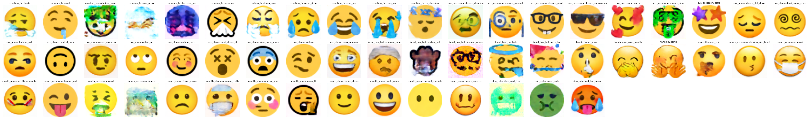
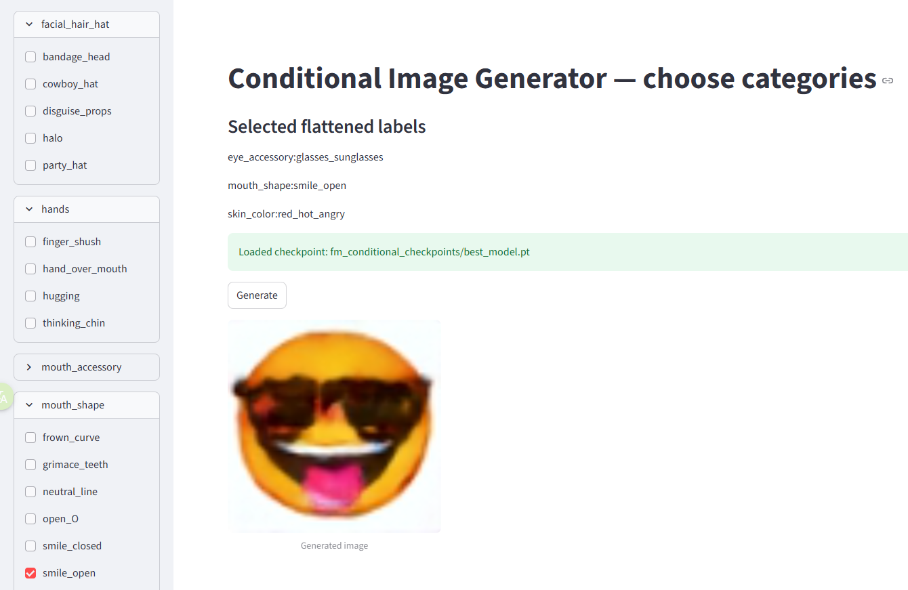

# Emoji 😄 Image Generator 

这是一个用flow matching训练的emoji图片生成器

##  数据集


一个专为生成任务整理的小型高质量 emoji 脸部数据集。
- Emoji face只收录了人脸形式的 emoji （对应emoji序号1~94, 可参考 [emoji_number.sjon](./emoji_number.json)）
- 已将透明背景的图片转成白色背景,方便模型拟合
- 每个emoji表情包含多个平台的版本 (Apple、Google ...) 


数据集已上传到[kaggle - emoji_face](https://www.kaggle.com/datasets/chzarles/emoji-face)


### 文件结构

数据集里包含一些图片和一个自制的标签文件`labels.json`。

图片按照emoji序号分类存放，不同emoji对应的序号

具体形式组织如下，详见 [EMOJI_FACE](./EMOJI_FACE/)
```
EMOJI_FACE/
├── 1
│   ├── Apple_1.png
│   ├── Facebook_1.png
...
│   └── Windows_1.png
├── 2 
│   ├── Apple_1.png
│   ├── Facebook_1.png
...
│   └── Windows_1.png
....
├── 94
│   ├── Apple_94.png
│   ├── Facebook_94.png
...
│   └── Windows_94.png
└── labels.json

```

[labels.json](./EMOJI_FACE/labels.json) 是一个标签文件，把每个 emoji（用数字 ID 和字符）按脸部特征分组。
- 顶层字段是若干类别（如 skin_color、eye_shape、mouth_shape 等）；
- 每个类别下面是若干子类（如 smiling_curve、frown_curve 等）。
- 每个子类的值是一个列表，元素形如 [id, "emoji"]，表示编号为 id 的表情属于该子类。

在进行无条件生成训练时，模型总是习惯于生成某一类特定的 Emoji，这就忽略了数据集中大量丰富的特征信息。
由于 Emoji 中的组合特征（如眼型、嘴型、肤色）非常丰富，因此可以对图像进行一些细粒度的**特征打标**，在训练过程中用这些标签转化为**条件向量Embedding** 输入模型。这样不仅能强制模型学习所有数据的分布，防止信息丢失，还能在生成时实现对特征的自由组合。


# 训练效果

#### 针对每个单独特征来进行采样


#### 使用每个图片id对应的特征组合采样 (1 ~ 94)
具体来说就是使用训练集图片的组合特征来采样


# 实现

参考下面两个文件
- [common_utils.py](./common_utils.py)
- [flow_matching_conditional.ipynb](./flow-matching-images.ipynb)
    - 这是使用flow matching方法的实现


#  组合特征测试
为了测试这个生成器是否能够将不同细粒度的脸部特征（例如眼型、嘴型、肤色等）正确组合并生成一致且自然的表情图像，项目提供了一个streamlit应用来测试不同的特征组合作为条件向量时的采样效果。

```bash
streamlit run streamlit_app.py 
```


> 这是 glasses_sunglasses +smile_open +red_hot_angry 的组合


实验发现使用训练集已有的特征组合能得到较高质量的生成结果；但如果输入任意未在训练集中出现的特征组合，模型通常只能还原出图像的轮廓和若干局部特征，难以生成语义一致且细节丰富的图像。
